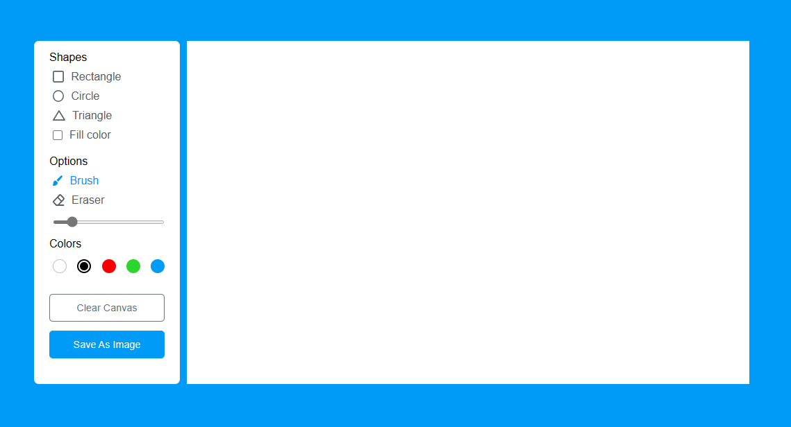

# Digisketch is digital writing board suitable for all screens

## Features In  Brief :
- Select from 5 different colors of brushes
- Select from a range of default basic shapes like the Rectangle, Circle and Triangle
- Set a fill color mode 
- An option to set the size of your brush and erazer
- Save your work as a JPEG or PNG file.

## You can checkout live project at : https://digisketch.vercel.app/

